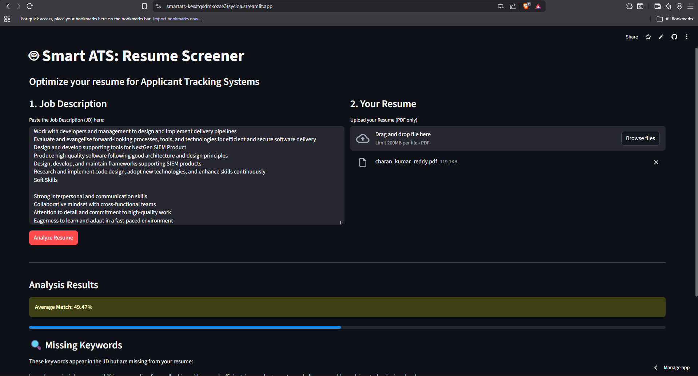

# 🤖 Smart ATS: Resume Screener

> A streamlined Applicant Tracking System (ATS) optimized to quantify resume-job fit using Natural Language Processing (NLP).

**🔗 [Test the Application Yourself](https://smartats-kesstqsdmxozse3tsycloa.streamlit.app/)** *(Click the link to test the application with your own resume!)*


## Preview of the application


## 📖 Overview
In the modern recruitment landscape, over 75% of resumes are rejected by automated ATS software before they ever reach a human recruiter. **Smart ATS** is a reverse-engineered solution designed to bridge this gap. 

This tool evaluates resumes against job descriptions (JDs) using **Cosine Similarity** algorithms. It provides candidates with a precise **Match Score (%)** and identifies **Missing Keywords**, effectively simulating the preliminary screening layer used to filter candidates.

## 🚀 Features
* **Instant Resume Scoring:** Upload a PDF and get an immediate match percentage based on industry-standard vectorization.
* **Keyword Gap Analysis:** Identifies critical skills and keywords present in the JD but missing from the candidate's profile.
* **Data Cleaning Pipeline:** Automatic preprocessing of text to remove noise (special characters, stop words, formatting issues) for accurate analysis.
* **Interactive Dashboard:** Built with Streamlit for a responsive, real-time user experience.

## 🛠️ Technical Architecture
The application follows a modular functional programming structure:

1.  **Text Extraction:** Uses `pdfminer.six` to parse unstructured data from PDF documents.
2.  **Preprocessing:** Cleanses text data by normalizing case, removing punctuation, and filtering stop words via Regex.
3.  **Vectorization:** Implements `CountVectorizer` (Scikit-Learn) to convert text documents into numerical vectors.
4.  **Similarity Computation:** Calculates the **Cosine Similarity** between the Resume Vector and JD Vector to determine alignment.

## ⚙️ Installation & Usage

**Prerequisites:** Python 3.8+

1.  **Clone the Repository**
    ```bash
    git clone [https://github.com/charankumar3009/Smart_ATS.git](https://github.com/charankumar3009/Smart_ATS.git)
    cd Smart_ATS
    ```

2.  **Create a Virtual Environment**
    ```bash
    python -m venv .venv
    # Windows
    .venv\Scripts\activate
    # Mac/Linux
    source .venv/bin/activate
    ```

3.  **Install Dependencies**
    ```bash
    pip install -r requirements.txt
    ```

4.  **Run the Application** 
    ```bash
    streamlit run ats_app.py
    ```

## 🧠 Engineering Trade-offs & Future Roadmap
*Current Version vs. Enterprise ATS:*

* **Current State (MVP):** Utilizes **frequency-based analysis** (`CountVectorizer`). It is highly efficient but relies on exact keyword matching.
* **Future Scope:** * Integrate **Semantic Search** (using BERT or Transformers) to understand context (e.g., knowing that "ML" and "Machine Learning" are synonyms).
    * Add **OCR Support** for scanned image-based PDFs.
    * Implement a **Database (SQLite/PostgreSQL)** to save user history and track improvement over time.
